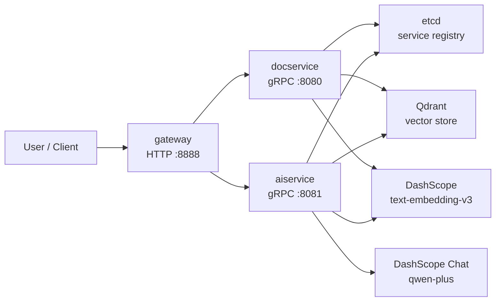

# go-zero-rag

基于 `go-zero` 的 RAG 知识问答微服务示例项目，包含文档摄入、向量检索、LLM 生成、HTTP Gateway、Docker 化部署和 K8s/Jenkins 交付清单。

## 项目亮点

- `docservice` 负责文档上传、按段落分块、调用通义千问 Embedding、写入 Qdrant
- `aiservice` 负责问题向量化、Qdrant Top-K 检索、拼装 Prompt、调用通义千问生成答案
- `gateway` 对外提供统一 HTTP API，内部通过 go-zero RPC 访问两个后端服务
- 提供本地 `docker-compose` 依赖环境，以及 K8s `Deployment/StatefulSet/ConfigMap/Secret` 示例
- 附带 Jenkins Pipeline，可并行构建三份镜像并自动发布到集群

## 系统架构



## 技术栈

- Go `1.25.1`
- go-zero `v1.10.1`
- gRPC + goctl
- Qdrant `v1.9.2`
- etcd `v3.6.4`
- DashScope `text-embedding-v3` + `qwen-plus`
- Docker / Kubernetes / Jenkins

## 目录结构

```text
.
├── aiservice/           # RAG 查询服务
├── docservice/          # 文档摄入服务
├── gateway/             # 对外 HTTP API
├── pkg/embed/           # 通义千问 Embedding 客户端
├── pkg/llm/             # 通义千问 Chat 客户端
├── pkg/qdrantcli/       # Qdrant REST 客户端
├── deploy/k8s/          # K8s 资源清单
├── deploy/jenkins/      # Jenkins Pipeline
└── docker-compose.yml   # 本地 etcd + Qdrant
```

## 核心流程

### 文档摄入

1. 客户端调用 `POST /api/doc/upload`
2. `gateway` 转发到 `docservice`
3. `docservice` 按段落切分文本，单块最大约 `800` 字符
4. 调用 DashScope `text-embedding-v3` 生成 `1536` 维向量
5. 将 chunk 文本和向量写入 Qdrant `documents` collection

### 问答查询

1. 客户端调用 `POST /api/qa/query`
2. `gateway` 转发到 `aiservice`
3. `aiservice` 对问题做 Embedding
4. 从 Qdrant 检索 Top-K 相关文本
5. 拼装 Prompt，调用 `qwen-plus`
6. 返回答案和命中的来源片段

## 本地运行

### 1. 启动依赖

```bash
cd go-zero-rag
docker compose up -d
```

这会启动：

- etcd: `127.0.0.1:2379`
- Qdrant REST: `127.0.0.1:6333`
- Qdrant gRPC: `127.0.0.1:6334`

### 2. 设置环境变量

```bash
export QWEN_API_KEY=your_dashscope_api_key
```

### 3. 启动三个服务

```bash
go run ./docservice -f docservice/etc/doc.yaml
```

```bash
go run ./aiservice -f aiservice/etc/ai.yaml
```

```bash
go run ./gateway -f gateway/etc/gateway.yaml
```

默认端口：

- `docservice`: `8080`
- `aiservice`: `8081`
- `gateway`: `8888`

## API 示例

### 上传文档

```bash
curl -X POST http://127.0.0.1:8888/api/doc/upload \
  -H 'Content-Type: application/json' \
  -d '{
    "title": "go-zero-rag 简介",
    "content": "RAG 是 Retrieval-Augmented Generation 的缩写。\n\n它先检索，再生成答案。"
  }'
```

示例响应：

```json
{
  "doc_id": "2e0b8867-3e84-4940-9328-4ae104bd17f9",
  "chunk_count": 1
}
```

### 提问

```bash
curl -X POST http://127.0.0.1:8888/api/qa/query \
  -H 'Content-Type: application/json' \
  -d '{
    "question": "什么是 RAG？",
    "top_k": 3
  }'
```

示例响应：

```json
{
  "answer": "RAG 是一种先检索知识，再让大模型基于检索结果生成答案的方法。",
  "sources": [
    "RAG 是 Retrieval-Augmented Generation 的缩写。",
    "它先检索，再生成答案。"
  ]
}
```

## K8s 部署

### 准备 Secret

```bash
kubectl -n rag create secret generic rag-secret \
  --from-literal=QWEN_API_KEY=your_dashscope_api_key
```

### 应用资源

```bash
kubectl apply -f deploy/k8s/namespace.yaml
kubectl apply -f deploy/k8s/etcd.yaml
kubectl apply -f deploy/k8s/qdrant.yaml
kubectl apply -f deploy/k8s/configmap.yaml
kubectl apply -f deploy/k8s/docservice.yaml
kubectl apply -f deploy/k8s/aiservice.yaml
kubectl apply -f deploy/k8s/gateway.yaml
```

默认暴露方式：

- `gateway` 通过 `NodePort 31888` 对外提供服务
- 集群内服务发现走 etcd
- `docservice` / `aiservice` 从 `rag-secret` 读取 `QWEN_API_KEY`

## Jenkins CI/CD

[deploy/jenkins/Jenkinsfile](deploy/jenkins/Jenkinsfile) 包含完整流水线：

- `Checkout`
- 并行构建并推送 `docservice` / `aiservice` / `gateway`
- `kubectl apply` 更新资源
- `kubectl rollout status` 检查发布状态

镜像仓库和部署地址目前是我的内网环境示例值，发布到公开仓库前建议改成你自己的 Registry 与集群入口。

## 当前进度

- 代码结构、接口、Dockerfile、K8s YAML、Jenkinsfile 已完成
- `go build ./...` 已于 `2026-04-21` 在本地重新验证通过
- 尚未完成的事项：
  - 需要真实 `QWEN_API_KEY` 才能完成本地端到端问答验证
  - 需要集群 `kubectl` 权限才能完成线上验证
  - 还未执行 GitHub public 发布和仓库展示检查

## 后续可继续完善

- 支持更多文档格式，例如 `pdf`、`md`、`docx`
- 增加重排、引用评分和答案置信度
- 为 `docservice` / `aiservice` 增加单元测试和集成测试
- 增加多租户、命名空间隔离和文档删除能力
